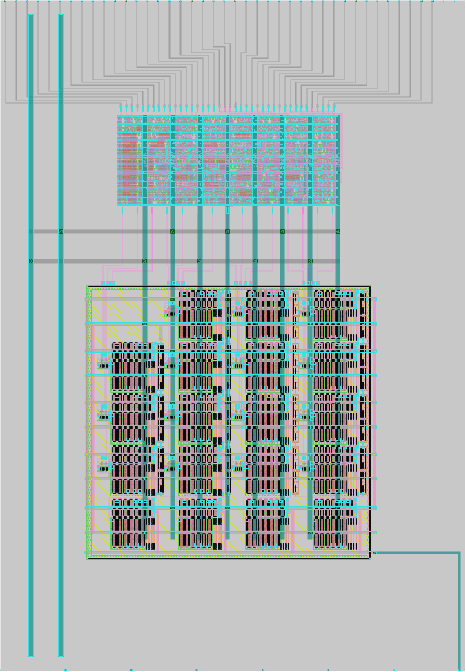

 

# 4-bit flash ADC with binary encoder

A resistor ladder between power and ground is used to generate 15 reference
voltages at regular intervals. The input signal is compared with each of them
to get the unary ADC output. To avoid loading the input too much, it goes
through some voltage followers before it gets to the comparators. Finally, a
digital encoder circuit converts the unary output to binary using a tree of
majority gates and multiplexers for error correction. The digital circuit also
implements some debugging logic.

[Read the full documentation](docs/info.md)

